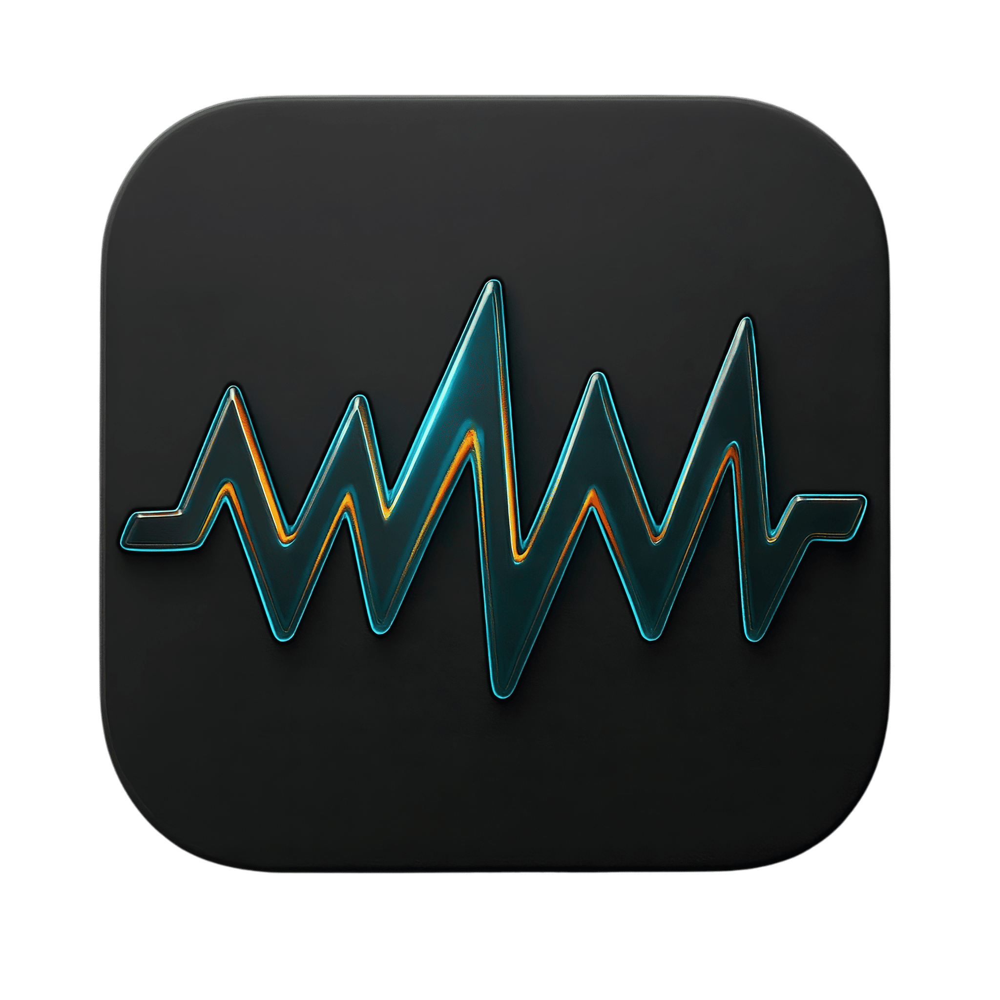

# Samplem

A Modern Audio Repacker & Classifier Toolkit

Samplem is a modular command-line toolkit for restoring, cleaning, and organizing vintage sample collections.
Originally built to repack 80s–90s sample CDs, it has grown into a broader system for sample cleanup, normalization, tagging, and classification.

Bring order to your chaos of WAVs: merge, normalize, tag, and rediscover your archive with elegance.

---

## Core Features

### Repack

Rebuild messy 80s–90s sample CDs into clean, modern folders.

* Detects and merges stereo pairs (`-L.wav` + `-R.wav`) into single stereo WAVs
* Copies mono files as-is
* Removes redundant "Partition A / Partition B ..." subfolders
* Offers three organization modes:

  1. Keep parent subfolders: preserves folders like "120 BPM", "Kicks", "Loops", etc.
  2. Flatten with parent prefix: all files go into one folder, prefixed by their source (e.g. `120BPM_Loop1.wav`)
  3. Flatten without prefix (default): one clean, flat folder
* Optional normalization (peak to 0 dBFS) and silence trimming (via [SoX](http://sox.sourceforge.net/))
* Generates a global `index.csv` with:

  * pack name, relative path, channel count, sample rate, bit depth, and duration

---

### Classify

Group and tag samples automatically using heuristics (and soon, ML-based models).

```bash
samplem classify <folder> --csv REPACKED/tags.csv --copy-into REPACKED/Classified
```

Or from source:

```bash
python3 classify.py <folder> --csv REPACKED/tags.csv --preview
```

Heuristics include:

* File name keywords (`kick`, `snr`, `hh`, `vox`, `pad`, `fx`, etc.)
* Duration analysis (short = percussive, long = ambient)
* Loudness / RMS ratio for intensity detection

Output example:

```
REPACKED/tags.csv
├── path,basename,category,confidence,duration,rms_peak_ratio
└── 909BD01.wav,909BD01.wav,Kick,0.98,0.42,0.85
```

Optionally, files are copied into:

```
REPACKED/Classified/
 ├── Kicks/
 ├── Snares/
 ├── HiHats/
 ├── FX/
 └── Unknown/
```

---

### Coming Soon

Samplem will evolve into a full modular audio toolkit:

* Pitch and tempo detection (via `librosa` / `aubio`)
* Loop detection and seamless trimming
* LUFS normalization for consistent loudness
* Spectral fingerprinting for similarity search
* SQLite index for fast queries across massive libraries
* Terminal UI for browsing, tagging, and previewing samples interactively
* Export and sync features for sharing curated packs

---

## Installation

### From source

```bash
git clone https://github.com/binjac/samplem.git
cd samplem
chmod +x repack_interactive.zsh
./repack_interactive.zsh --help
./repack_interactive.zsh --version
```

### Install

```bash
git clone https://github.com/binjac/samplem.git
cd samplem
chmod +x install.sh
./install.sh
```

After that, you can run from anywhere:
```bash
samplem --help
samplem repack
```

### Requirements

* macOS or Linux with zsh
* [SoX](http://sox.sourceforge.net/) (brew install sox or sudo apt install sox)

---

## Roadmap

| Phase | Focus           | Description                               |
| ----- | --------------- | ----------------------------------------- |
| v0.9  | Repack core     | Clean, merge, normalize legacy sample CDs |
| v1.0  | Swift drag and drop app     | UI to enable drag and drop of sample folders |
| v1.1  | Divide sample chains  | Divide sample chains by checking transients, zero crossings and silences |
| v1.2  | Classification  | Heuristic classification and CSV tagging  |
| v1.3  | Pitch and tempo | Auto-key and BPM detection                |
| v1.4  | Similarity      | Find and cluster similar samples          |
| v2.0  | UI and database | Terminal UI and local sample index DB     |

---

## Vision

Samplem aims to become the go-to open-source command-line environment for sound archivists and producers, offering reliable utilities to restore, tag, and explore vast sample libraries from 90s CDs to modern field recordings.
